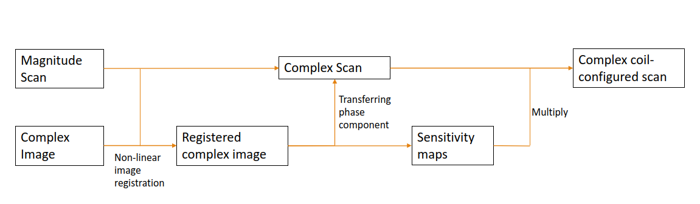
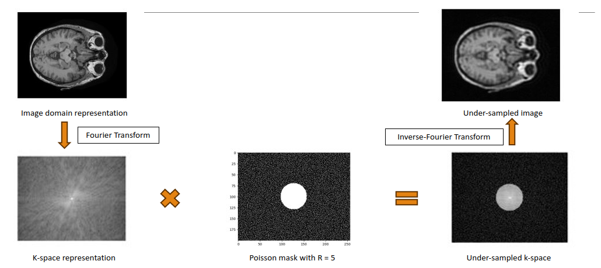
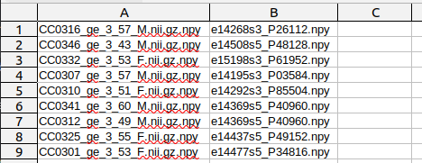
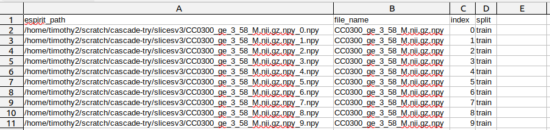
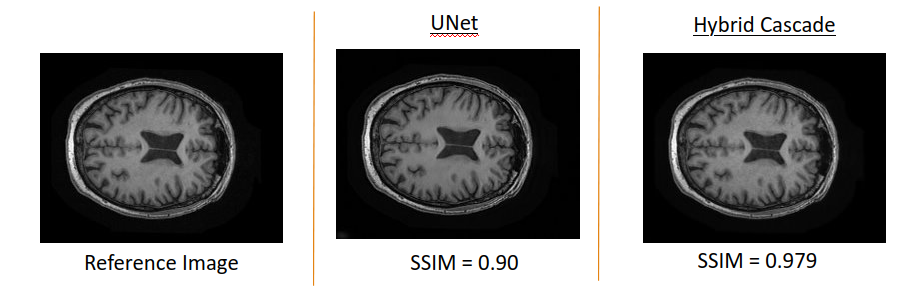
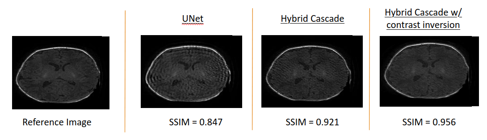

# Newborn MRI Reconstruction: Translating Adult-Trained Models

## Overview

This repository contains code and resources for a deep learning project focused on MRI reconstruction. The project includes the training of a deep learning model using complex 12-coil adult MRI images and testing its domain adaptivity on newborn MRI images, including the evaluation of contrast inversion techniques. Notably, the Hybrid Cascade model outperformed the baseline UNet model. Additionally, the implementation of the contrast inversion procedure resulted in an increase of SSIM scores for specific images; however, the extent of this enhancement varied across the dataset.

## Table of Contents

- [Prerequisites](#prerequisites)
- [Repository Structure](#repository-structure)
- [Methodology](#methodology)
- [Usage](#usage)
- [CSV File Examples](#csv-file-examples)
- [Results](#results)

## Prerequisites

- [**Using the BART toolbox on an HPC cluster**](BART-in-container.md)

## Repository Structure

- `preprocessing/`: Contains scripts related to data preprocessing before training.
- `unet/`: Code for the UNet model tested in this project.
- `hybrid-cascade/`: Code for the hybrid cascade model.
- `hybrid-cascade-contrast-inverted/`: Extensions for the hybrid cascade model with contrast inversion.

## Methodology

### Data Processing Flow

  

<em>Data Processing Flow</em>

### Retrospective Undersampling

  

<em>Retrospective Undersampling</em>

## Usage

1. **Data Preprocessing**: 

    a. **Adding phase and converting into 12 coil configuration**:
      - File(s): `preprocessing/adding_phase_and_coil.py`
      - Description: Every magnitude-only image is randomly mapped with a complex-valued MRI image from an external dataset. After image registration, the phase component is extracted from the complex image and incorporated into the magnitude image, thus transforming it into a complex image.
   
    b. **Generating 2D MRI slices**:
      - File(s): `preprocessing/slicer.py`
      - Description: Each 3D MRI volume is sliced into 2D images for training.

    c. **Generating under sampling masks**:
      - File(s): `preprocessing/undersampling_masks.py`
      - Description: Poisson disks are utilized to generate undersampling masks with an undersampling factor, R = 5.

2. **UNet Model**:
   - Directory: `unet/`
   - Description: The UNet model is trained on the adult MR images and tested on newborn MR images.

3. **Hybrid Cascade Model**:
   - Directory: `hybrid-cascade/`
   - Description: The hybrid cascade model, without any domain adaptation techniques, is trained and tested.

4. **Hybrid Cascade with Contrast Inversion**:
   - Directory: `hybrid-cascade-contrast-inverted/`
   - Description: The hybrid cascade model is trained on adult MR images that have undergone contrast inversion. It is then tested on newborn MR images.

## CSV File Examples

  

<em>Example of the file mapping in Step 1.a.</em>

  

<em>Example of the csv of 2D image slices</em>

## Results

### Adult Dataset

  

<em>Results - Adult Dataset </em>

### Newborn Dataset

A more detailed comparison of contrast inversion results is presented [here](https://uofc-my.sharepoint.com/:b:/g/personal/timothy_george_ucalgary_ca/ESLcAUHYQUJDq9hTAYg_CCkBpnZhCGc8sA3LWaExlFD9-A?e=N3JrY1).

  

<em>Results - Newborn Dataset</em>

## Acknowledgements

- The [Advanced Imaging and Artificial Intelligence Lab](https://www.ai2lab.ca/) at the University of Calgary.
- The [Vascular Imaging Lab](https://cumming.ucalgary.ca/labs/vascular-imaging/vascular-imaging) at the University of Calgary.
